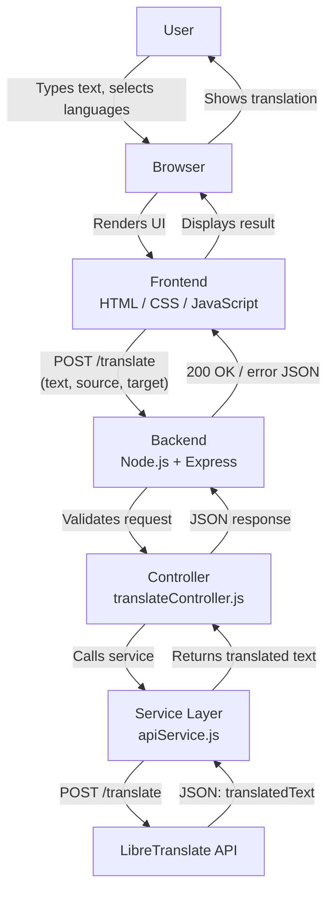

# System Architecture — Language Translation Tool

This document explains the architecture of the Language Translation Tool: how the frontend, backend, and external translation API fit together, and how a single translation request flows through the system from start to finish.

---

## 1. High-Level Architecture

The application follows a classic **three-tier architecture**:

1. **Presentation Tier (Frontend)** — HTML, CSS, and JavaScript running in the user's browser.
2. **Application Tier (Backend)** — A Node.js/Express REST API that validates requests and mediates access to the translation provider.
3. **External Service Tier (Translation API)** — LibreTranslate, a free, open-source machine translation API.

```
┌────────┐     ┌───────────┐     ┌────────────────────┐     ┌──────────────────┐
│  User  │ --> │  Browser  │ --> │  Frontend (HTML/    │ --> │  Backend (Node.js │
│        │     │           │     │  CSS/JavaScript)     │     │  + Express)       │
└────────┘     └───────────┘     └────────────────────┘     └────────┬──────────┘
                                                                       │
                                                                       ▼
                                                              ┌──────────────────┐
                                                              │ LibreTranslate API │
                                                              └──────────────────┘
```

See `diagrams/SystemArchitecture.png` for the full visual diagram (also reproduced as Mermaid below).



---

## 2. Frontend

**Location:** `frontend/`

The frontend is a static site (`index.html`, `style.css`, `script.js`) with no build step or framework. Its responsibilities are:

- Rendering the UI: language dropdowns, text areas, buttons, loading spinner, and error box.
- Collecting user input (source text, source language, target language).
- Performing lightweight client-side validation (empty text, identical source/target).
- Sending translation requests to the backend via `fetch()` as `POST /translate`.
- Rendering the translated text, or a friendly error message if something goes wrong.
- Providing bonus UX features that don't require the backend at all: Copy (Clipboard API), Text-to-Speech (Web Speech API), Swap Languages, and a live character counter.

The frontend **never** calls the translation provider (LibreTranslate) directly. This is a deliberate architectural decision — see Section 4.

---

## 3. Backend

**Location:** `backend/`

The backend is a Node.js/Express REST API structured in layers:

| Layer | File | Responsibility |
|---|---|---|
| Entry point | `server.js` | Configures Express, middleware (CORS, JSON parsing), mounts routes, starts the HTTP server |
| Routes | `routes/translate.js` | Maps `POST /translate` to its controller function |
| Controller | `controllers/translateController.js` | Validates the request body, calls the service layer, shapes the HTTP response |
| Service | `services/apiService.js` | The only file that talks to LibreTranslate; handles the HTTP call, timeouts, and error normalization |

This separation (routes → controllers → services) is a standard Express project convention. It keeps each file focused on one responsibility, makes the codebase easy to navigate, and makes it simple to swap the translation provider later by editing only `apiService.js`.

---

## 4. Translation API (LibreTranslate)

The project uses **LibreTranslate**, a free and open-source translation API, as the underlying translation engine.

**Why the backend calls LibreTranslate instead of the frontend:**

- **Security:** If an API key is required by the chosen LibreTranslate instance, it stays in the backend's `.env` file and is never exposed in client-side JavaScript.
- **Flexibility:** The translation provider can be swapped (e.g., to a self-hosted LibreTranslate instance, or a different provider entirely) by editing a single file (`apiService.js`) without touching the frontend.
- **Control:** The backend can add validation, rate-limiting, caching, or logging in one central place.
- **CORS:** Some public LibreTranslate instances restrict which origins may call them directly; routing through our own backend avoids this entirely.

The backend's `LIBRETRANSLATE_URL` and `LIBRETRANSLATE_API_KEY` are configured via environment variables (see `.env.example`), so the provider can be changed without modifying code.

---

## 5. User Flow

1. The user opens `index.html` in their browser.
2. The user types text into the source text area and selects a source and target language.
3. The user clicks **Translate**.
4. The frontend validates the input locally and shows a loading spinner.
5. The frontend sends the request to the backend.
6. The backend validates, forwards the request to LibreTranslate, and returns the result.
7. The frontend hides the spinner and displays the translated text, or an error message if something failed.
8. The user may optionally copy the translation, listen to it via text-to-speech, swap languages, or clear the form.

---

## 6. Request Flow

```
Browser
  │
  │ fetch("http://localhost:5000/translate", {
  │   method: "POST",
  │   body: { text, source, target }
  │ })
  ▼
Express server (server.js)
  │  — CORS check
  │  — JSON body parsing
  ▼
Router (routes/translate.js)
  │  — matches POST /translate
  ▼
Controller (controllers/translateController.js)
  │  — validates text/source/target
  ▼
Service (services/apiService.js)
  │  — builds request body { q, source, target, format }
  │  — sends POST to LIBRETRANSLATE_URL
  ▼
LibreTranslate API
```

---

## 7. Response Flow

```
LibreTranslate API
  │  — returns { "translatedText": "..." }
  ▼
Service (services/apiService.js)
  │  — extracts translatedText
  │  — throws normalized Error on failure (with statusCode)
  ▼
Controller (controllers/translateController.js)
  │  — wraps in { success: true, translatedText }
  │  — or { success: false, message } on error
  ▼
Express server
  │  — sends JSON response with appropriate HTTP status
  ▼
Browser (script.js)
  │  — hides loading spinner
  │  — renders translated text OR shows error box
  ▼
User sees the result
```

---

## 8. Design Principles Applied

- **Separation of concerns:** Frontend, backend routing, business logic, and external API calls each live in their own layer/file.
- **Fail gracefully:** Every layer catches and normalizes its own errors so the user always sees a clear, human-readable message instead of a raw stack trace.
- **Configuration over hardcoding:** The translation provider's URL and API key are environment variables, not hardcoded strings.
- **Statelessness:** The backend holds no session or database state — every request is self-contained, which keeps the API simple to scale and deploy.
